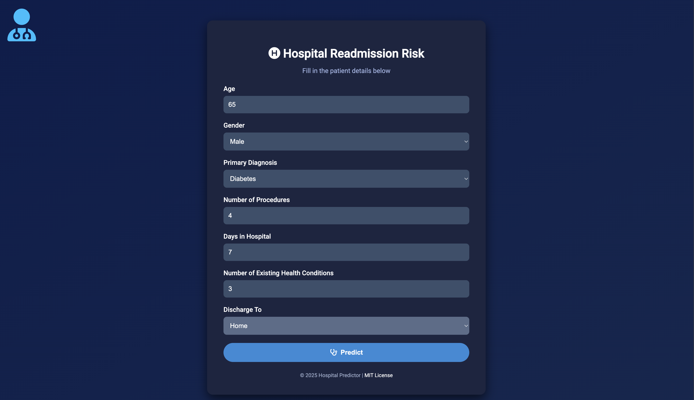
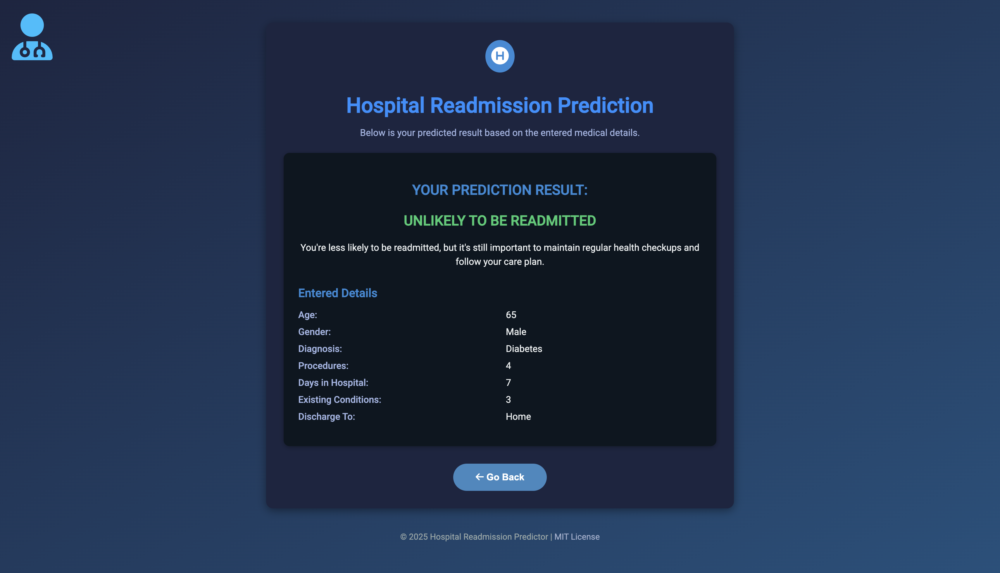
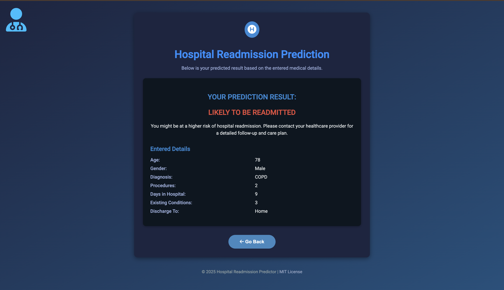

# 🏥 Hospital Readmission Risk Predictor

A Flask web app that predicts whether a patient is likely to be readmitted to the hospital based on demographic and clinical features using a trained Random Forest model.

---

## 📋 Features

* **User-friendly form** to capture patient details:

  * Age, Gender, Primary Diagnosis
  * Number of Procedures, Days in Hospital
  * Number of Existing Health Conditions, Discharge Destination
* **Real-time prediction** of readmission risk
* **Color-coded result**: 🔴 High risk (Likely to be readmitted), 🟢 Low risk (Unlikely to be readmitted)
* **Summary of entered details** for verification
* **Responsive dark-themed UI** with icons and animations

---

## 🚀 Getting Started

1. Clone the repository:

   ```bash
   git clone https://github.com/Trevin07/Machine-Learning-with-Python.git
   cd Machine-Learning-with-Python/hospital-readmission-app
   ```
2. Create and activate a virtual environment:

   ```bash
   python3 -m venv venv
   source venv/bin/activate      # macOS/Linux
   # venv\Scripts\activate     # Windows
   ```
3. Install dependencies:

   ```bash
   pip install -r requirements.txt
   ```
4. Run the Flask app:

   ```bash
   flask run --port=5002
   ```
5. Open your browser at [http://localhost:5002](http://localhost:5002)

---

## 📸 Screenshots

<p align="center">
  
  
  
</p>

---

## 🗂 Project Structure

```
hospital-readmission-app/
├── app.py                 # Flask application
├── model/
│   └── rf_model.pkl       # Trained Random Forest model
├── static/
│   ├── styles.css         # Custom CSS
│   ├── screenshot1.png
│   ├── screenshot2.png
│   └── screenshot3.png
├── templates/
│   ├── index.html         # Input form
│   └── result.html        # Prediction results
├── requirements.txt       # Python dependencies
└── README.md              # Project overview and instructions
```

---

## ⚖️ License

This project is released under the [MIT License](https://opensource.org/licenses/MIT).

